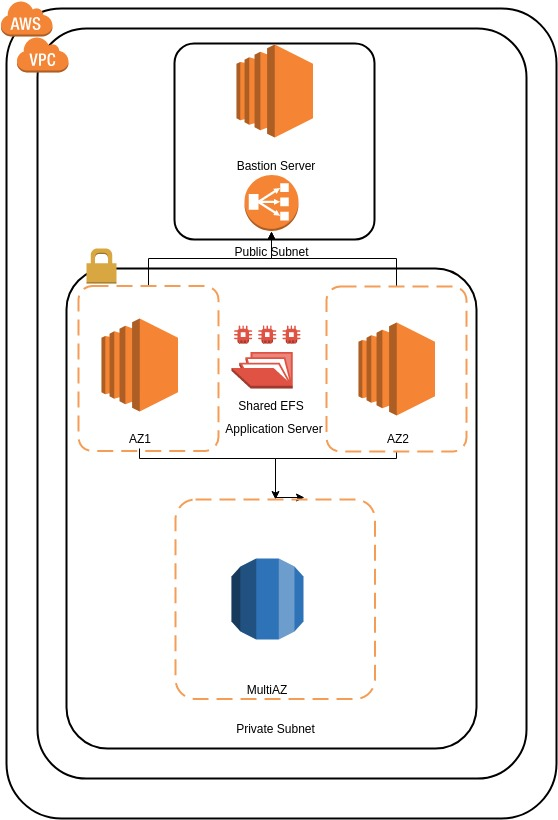

# wp-terraform

Architecture Diagram

Just Clone the repository.

EXPORT the ACCESS and SECRET key in local Env. And also make sure that the Key Associated with the IAM User should have required permission. Since EFS is not available in all the regions, so for now I have restricted it to Ireland region only. So all of your infra and application will setup in Ireland region.

Go to the cloned directory

Hit below command.

terraform apply

Post that you will get one elb dns. Hit that after a min of completion and you will get one wordpress website.

